# HW4: Observability — Spring Actuator, Micrometer, Prometheus, Grafana

## Выполнено

### 1. Подключение Spring Actuator и Micrometer

В оба сервиса (`currency-rate-provider` и `rate-printer`) добавлены зависимости:

- `spring-boot-starter-actuator` — эндпоинты для мониторинга
- `micrometer-registry-prometheus` — экспорт метрик в Prometheus

### 2. Конфигурация метрик

**application.properties** (оба сервиса):

- `management.endpoints.web.exposure.include=*` — открыты все Actuator эндпоинты
- `management.metrics.tags.application=${spring.application.name}` — common tag для разбивки по сервисам
- `management.metrics.distribution.percentiles-histogram.http.server.requests=true` — включены histogram для вычисления P50/P95/P99
- `management.metrics.distribution.percentiles.http.server.requests=0.5,0.95,0.99` — серверные персентили времени ответа
- `info.app.version=@project.version@` — версия из pom.xml

### 3. Логирование запросов и ответов

**На сервере (provider)** — `ObservabilityConfig.java`:

- `CommonsRequestLoggingFilter` логирует request/response (method, URI, headers, status, time taken)
- `ClientMetricsFilter` считает количество запросов с разбивкой по клиентам (через header `X-Service-Name` и Counter метрику `custom_http_requests_total`)

**На клиенте (printer)** — `RestTemplateConfig.java`:

- `ClientRequestLoggingInterceptor` логирует исходящие запросы и ответы
- Добавляет header `X-Service-Name: rate-printer` во все запросы к серверу

**При старте** (оба сервиса):

- `ApplicationRunner` выводит в лог версию приложения: `"App version: 1.0.0"`

### 4. Prometheus

- Prometheus запущен в Docker-контейнере (`prom/prometheus:latest`) на порту **9090**
- Настроен сбор метрик с 3 job'ов:
  - `currency-rate-provider` (10.0.0.1:8080/actuator/prometheus)
  - `rate-printer` (10.0.0.1:8081/actuator/prometheus)
  - `zookeeper` (zookeeper:7000/metrics)
- Все targets в статусе **UP**

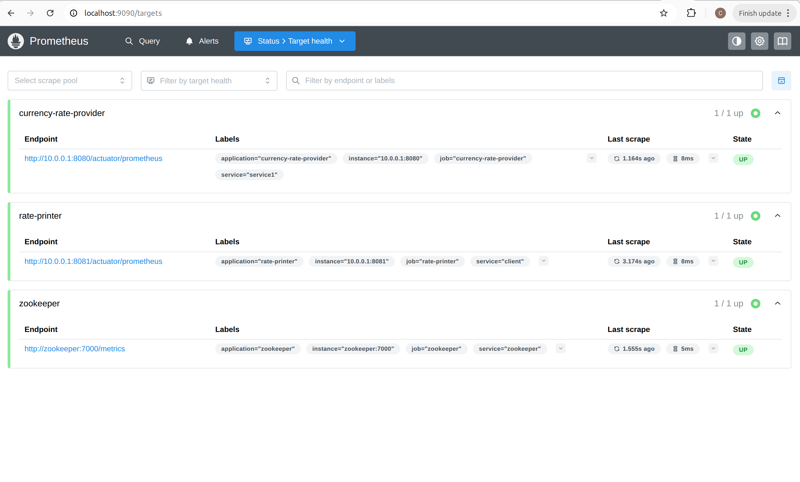
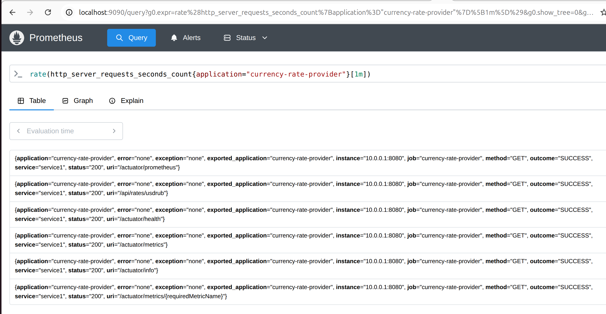

### 5. Grafana

- Grafana запущена в Docker-контейнере (`grafana/grafana:latest`) на порту **3000**
- **DataSource**: Prometheus (autoprovisioning, URL: `http://prometheus:9090`)
- **Дашборды** (autoprovisioning через YAML):
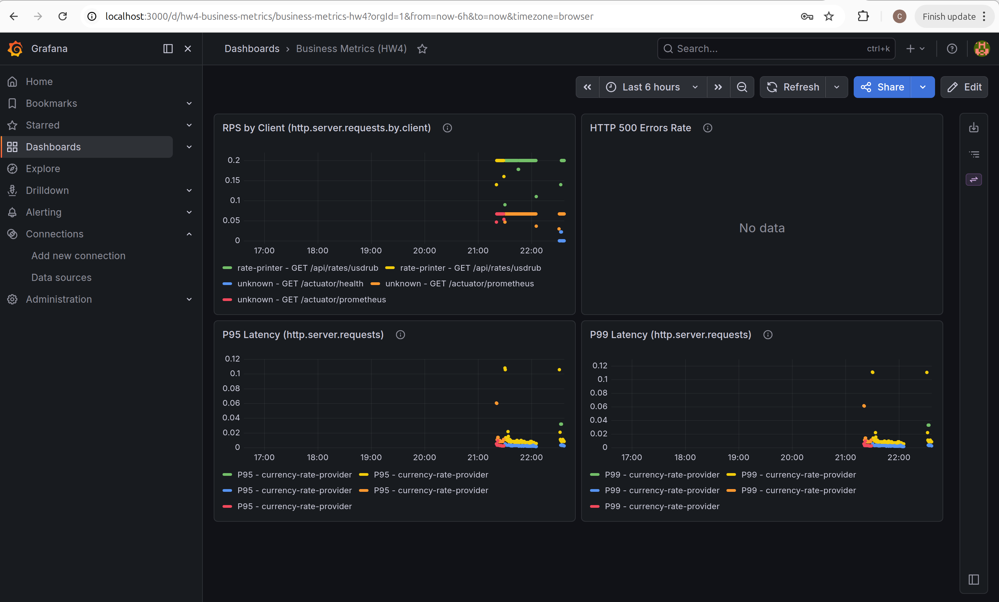
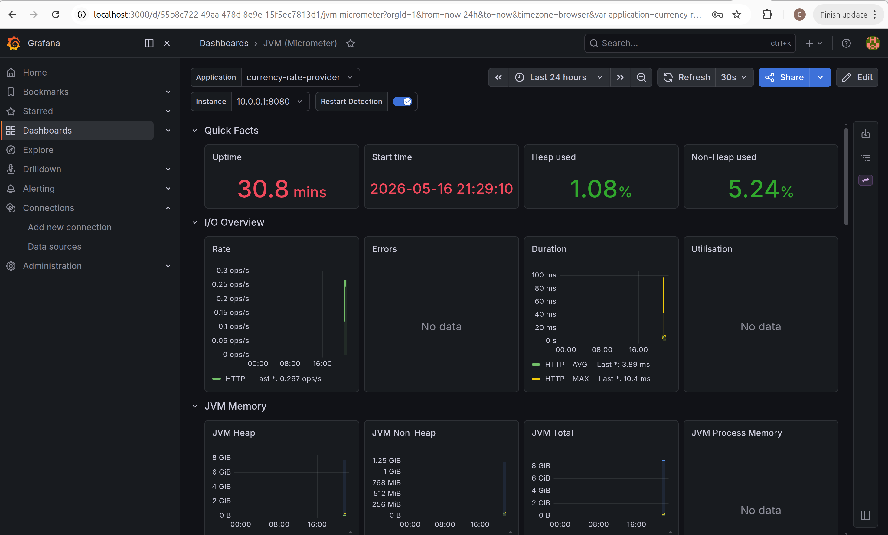


#### 5a. JVM (Micrometer) — ID 4701
- Скачан с grafana.com
- Исправлен: `${DS_PROMETHEUS}` заменён на имя datasource `"Prometheus"` для корректной работы при provisioning
- Отображает: JVM Heap/Non-Heap, GC, Threads, HTTP Rate/Errors/Duration, Tomcat Utilisation
- Фильтры по `application` и `instance`

#### 5b. Custom Business Metrics
- Кастомный дашборд с панелями:
  - USDRUB Rate — текущий курс (Gauge)
  - HTTP Rate — запросы в секунду с разбивкой по клиентам
  - HTTP P50/P95/P99 — персентили времени ответа
  - Errors 5xx — количество 500-х ошибок

### 6. Состояние системы

Все сервисы запущены и работают:

| Сервис | Статус | Endpoint |
|---|---|---|
| currency-rate-provider | UP | `localhost:8080/actuator/health` |
| rate-printer | UP | `localhost:8081/actuator/health` |
| Prometheus | UP | `localhost:9090/graph` |
| Grafana | UP | `localhost:3000` (admin/admin) |
| ZooKeeper | UP | `localhost:2181` |

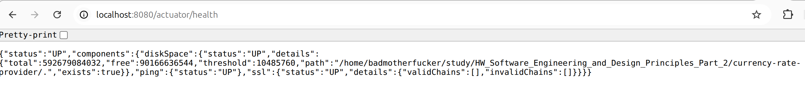
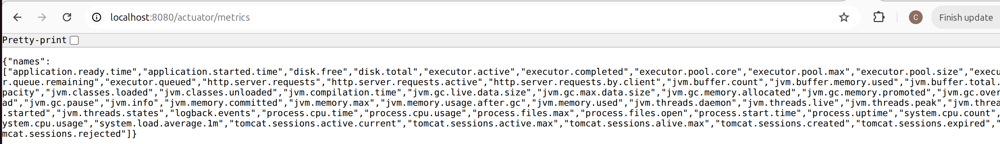
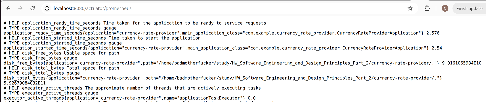
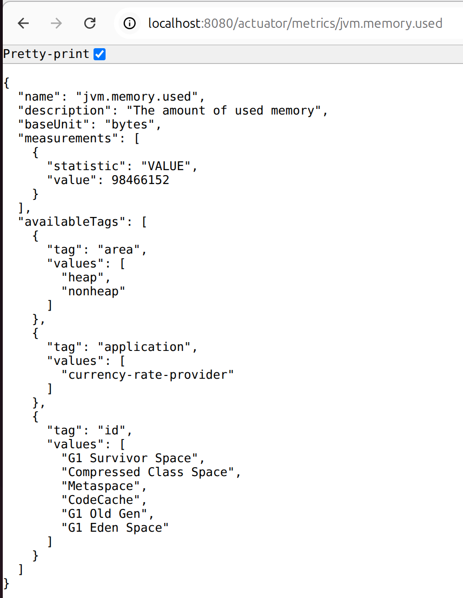
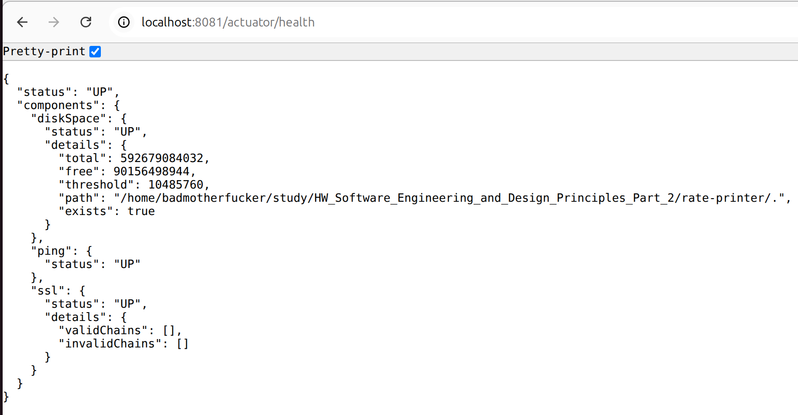
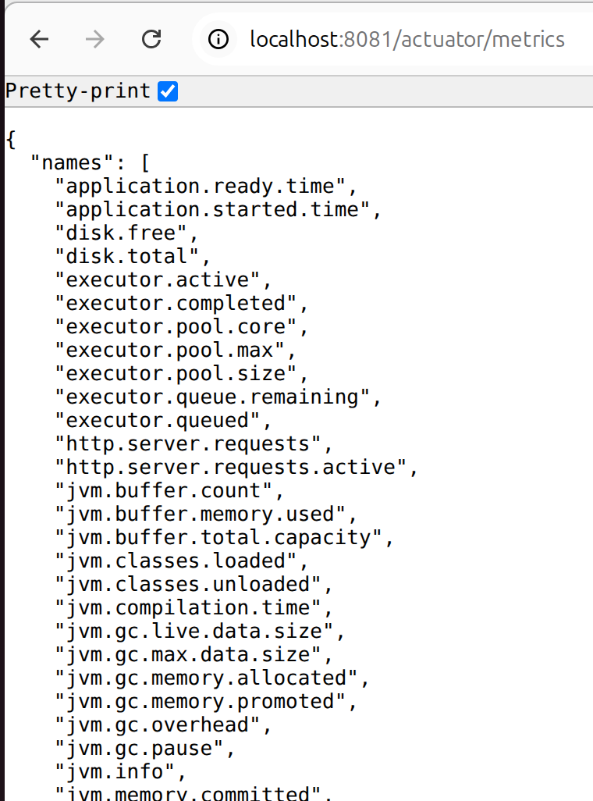
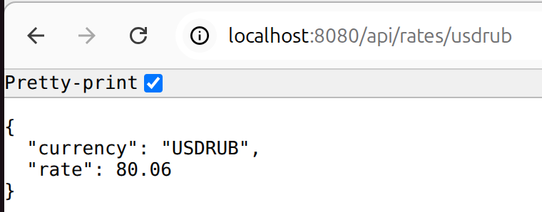


## Файлы

| Файл | Назначение |
|---|---|
| `currency-rate-provider/pom.xml` | Зависимости Actuator + Micrometer Prometheus |
| `rate-printer/pom.xml` | Зависимости Actuator + Micrometer Prometheus |
| `currency-rate-provider/src/main/resources/application.properties` | Конфигурация метрик, Actuator, версия, персентили |
| `rate-printer/src/main/resources/application.properties` | Конфигурация метрик, Actuator, версия, персентили |
| `currency-rate-provider/.../ObservabilityConfig.java` | Логирование + версия + ClientMetricsFilter |
| `rate-printer/.../ObservabilityConfig.java` | Логирование версии при старте |
| `rate-printer/.../RestTemplateConfig.java` | ClientRequestLoggingInterceptor + X-Service-Name |
| `monitoring/prometheus.yml` | Конфигурация scrape targets |
| `monitoring/grafana-provisioning/datasources/prometheus.yml` | DataSource provisioning |
| `monitoring/grafana-provisioning/dashboards/dashboards.yml` | Dashboard provisioning provider |
| `monitoring/grafana-provisioning/dashboards/jvm-micrometer_4701.json` | JVM (Micrometer) dashboard |
| `monitoring/grafana-provisioning/dashboards/custom-business-metrics.json` | Кастомный бизнес-дашборд |
| `docker-compose.yml` | ZooKeeper + Postgres + Pact Broker + Prometheus + Grafana |

## Сборка и запуск

```bash
# 1. Поднять инфраструктуру (ZooKeeper, Prometheus, Grafana и др.)
docker compose up -d

# 2. Собрать и запустить provider
cd currency-rate-provider
./mvnw clean package -DskipTests
nohup ./mvnw spring-boot:run > /tmp/rate-provider.log &

# 3. Собрать и запустить printer
cd ../rate-printer
./mvnw clean package -DskipTests
nohup ./mvnw spring-boot:run > /tmp/rate-printer.log &

# 4. Проверить
curl http://localhost:8080/actuator/health
curl http://localhost:8081/actuator/health
curl http://localhost:9090/api/v1/targets | jq .data.activeTargets[].health

# 5. Grafana: http://localhost:3000 (admin/admin)
```

## Вывод

Observability стек полностью настроен:
- **Spring Actuator** предоставляет health check и метрики
- **Micrometer** собирает JVM, HTTP, Tomcat и бизнес-метрики
- **Prometheus** забирает метрики с обоих сервисов и ZooKeeper
- **Grafana** визуализирует метрики в JVM-дашборде (ID 4701) и кастомном дашборде

Реализованы требования ТЗ:
- Логирование запросов/ответов на сервере и клиенте ✅
- Логирование версии при старте ✅
- Метрики: кол-во запросов в секунду с разбивкой по клиентам, кол-во 500-х ошибок, время обработки (среднее, медиана, P95/P99 персентиль) ✅