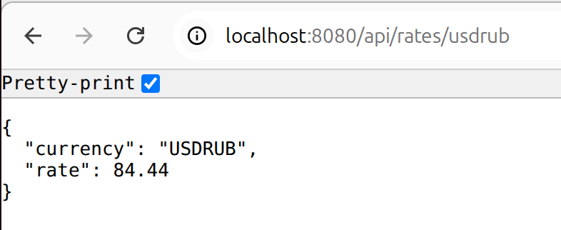
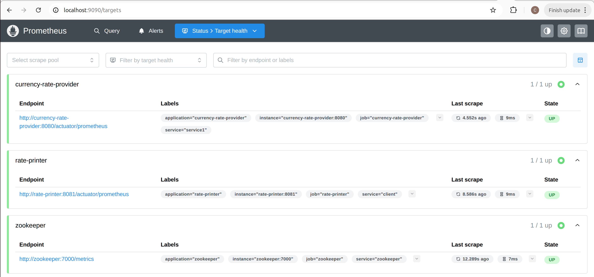
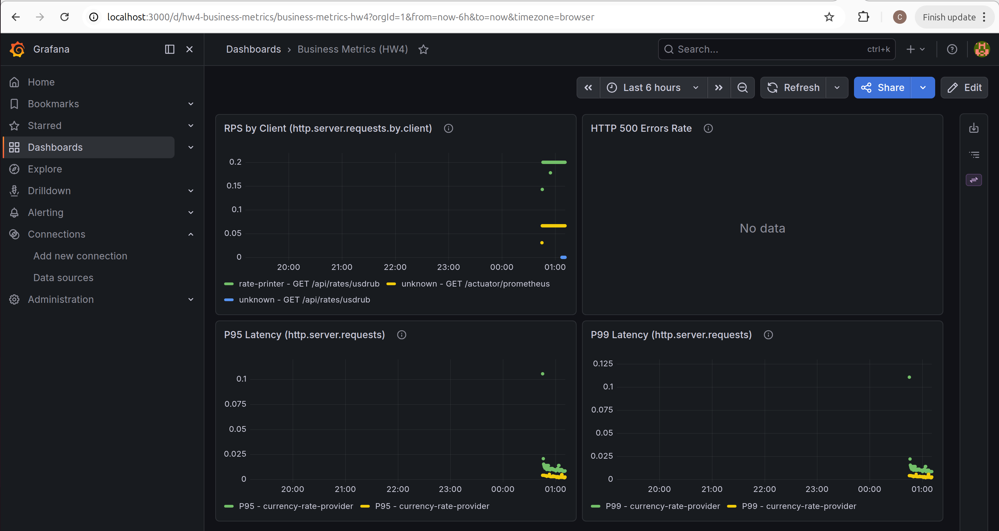
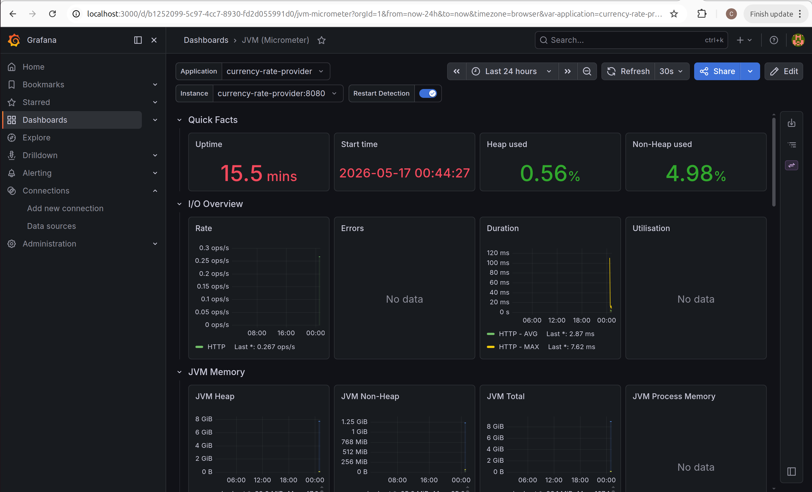

# HW5: Приложение двенадцати факторов (12-Factor App)

## Выполненные доработки

| № | Фактор | Статус | Что сделано |
|---|--------|--------|-------------|
| I | **Кодовая база** | ✅ | Два отдельных репозитория (currency-rate-provider, rate-printer), общий код отсутствует |
| II | **Зависимости** | ✅ | Все зависимости явно объявлены в pom.xml, изолированы через Maven |
| III | **Конфигурация** | ✅ | Константы `BASE_RATE`/`VARIATION` вынесены в `application.properties` как `rate.base`, `rate.variation`. `@Value` в `RateController` |
| IV | **Backing Services** | ✅ | ZooKeeper address вынесен в `zookeeper.connect-string`, читается из `@Value` в `CuratorConfig` (оба сервиса) |
| V | **Сборка, релиз, выполнение** | ✅ | Созданы Maven profiles (dev/prod), `application-dev.properties` и `application-prod.properties`, multi-stage Dockerfile (build → run) |
| VI | **Процессы** | ✅ | Сервисы stateless, горизонтальное масштабирование через процессы |
| VII | **Port binding** | ✅ | Самодостаточные Spring Boot приложения, порты 8080 и 8081 |
| VIII | **Параллелизм** | ✅ | Масштабирование через процессы, отсутствие shared state |
| IX | **Одноразовость** | ✅ | `server.shutdown=graceful`, `spring.lifecycle.timeout-per-shutdown-phase=30s`, `@PreDestroy` с корректным завершением потока polling |
| X | **Паритет разработки/работы** | ✅ | Раздельные `docker-compose.dev.yml` и `docker-compose.prod.yml`, разные Spring profiles для dev/prod |
| XI | **Логирование** | ✅ | Все логи пишутся в stdout через SLF4J, нет файловых appender'ов |
| XII | **Задачи администрирования** | ✅ | Разовые скрипты через Maven/Java — не требуются для данного приложения |

## Детали реализации

### Фактор III — Конфигурация
- `RateController.java`: константы `BASE_RATE=80.0` и `VARIATION=2.0` заменены на `@Value("${rate.base}")` и `@Value("${rate.variation}")`
- `application.properties` (provider): `rate.base=80.0`, `rate.variation=2.0`

#### Скриншот 1 — API возвращает курс

*Рисунок 1 — Response от currency-rate-provider: GET /api/rates/usdrub*

### Фактор IV — Backing Services
- `CuratorConfig.java` (оба сервиса): `@Value("${zookeeper.connect-string:localhost:2181}")` вместо хардкода
- Адрес ZooKeeper задаётся в `application.properties`: `zookeeper.connect-string=localhost:2181`
- При запуске через Docker переопределяется через `ZOOKEEPER_CONNECT_STRING=zookeeper:2181`


### Фактор V — Сборка, релиз, выполнение
- Созданы profile-специфичные файлы:
  - `application-dev.properties` — DEBUG логирование, dev-настройки
  - `application-prod.properties` — INFO логирование, prod-настройки (variation=5.0, таймаут shutdown 60s)
- `Dockerfile` — multi-stage сборка (maven build → JRE run)
- Запуск через профиль: `-Dspring.profiles.active=dev` или `SPRING_PROFILES_ACTIVE=prod`

### Фактор IX — Одноразовость (Graceful Shutdown)
- `application.properties` (оба сервиса):
  ```properties
  server.shutdown=graceful
  spring.lifecycle.timeout-per-shutdown-phase=30s
  ```
- `RatePrinterService.java`:
  - `ExecutorService` вместо `new Thread()` — управляемый пул потоков
  - `AtomicBoolean running` — флаг для graceful остановки цикла
  - `@PreDestroy stopPrinting()` — `executor.shutdownNow()` + `awaitTermination(10s)`
  - Обработка `InterruptedException` в цикле polling


### Фактор X — Паритет разработки/работы
- `docker-compose.dev.yml` — минимальный набор: ZooKeeper + оба сервиса с dev-профилем
- `docker-compose.prod.yml` — полный стек: ZooKeeper + Postgres + Pact Broker + Prometheus + Grafana + сервисы с prod-профилем

### Мониторинг (Prometheus + Grafana)

#### Скриншот 2 — Prometheus targets

*Рисунок 2 — Prometheus targets: все микросервисы в статусе UP*


#### Скриншот 3 — Grafana: Business Metrics (HW4)

*Рисунок 3 — Grafana дашборд Business Metrics (HW4): RPS, latency, errors*


#### Скриншот 4 — Grafana: JVM (Micrometer)

*Рисунок 4 — Grafana дашборд JVM (Micrometer): Heap, CPU, Threads, GC для currency-rate-provider*


### Фактор XI — Логирование
- Все логи через SLF4J → stdout (консоль Spring Boot по умолчанию)
- Нет `logback.xml` с FileAppender, нет записи в файлы
- `logging.level` настраивается через профили (dev/prod)


## Структура изменённых и созданных файлов

```
.
├── currency-rate-provider/
│   ├── Dockerfile                          # NEW: multi-stage Dockerfile
│   └── src/main/resources/
│       ├── application.properties           # MODIFIED: +zookeeper, +rate.*, +graceful shutdown
│       ├── application-dev.properties       # NEW: dev-настройки
│       └── application-prod.properties      # NEW: prod-настройки
├── rate-printer/
│   ├── Dockerfile                          # NEW: multi-stage Dockerfile
│   └── src/main/resources/
│       ├── application.properties           # MODIFIED: +zookeeper, +graceful shutdown
│       ├── application-dev.properties       # NEW: dev-настройки
│       └── application-prod.properties      # NEW: prod-настройки
├── docker-compose.dev.yml                  # NEW: dev-окружение
├── docker-compose.prod.yml                 # NEW: prod-окружение
├── .../controller/RateController.java       # MODIFIED: константы → @Value
├── .../config/CuratorConfig.java            # MODIFIED: хардкод → @Value (оба сервиса)
└── .../service/RatePrinterService.java      # MODIFIED: graceful shutdown через @PreDestroy
```

## Запуск

### Dev-окружение
```bash
# Сборка и запуск через Docker
docker compose -f docker-compose.dev.yml up --build

# Или локально через Maven + Spring profiles
cd currency-rate-provider
mvn spring-boot:run -Dspring-boot.run.profiles=dev
cd rate-printer
mvn spring-boot:run -Dspring-boot.run.profiles=dev
```

### Prod-окружение
```bash
# Полный набор с мониторингом
docker compose -f docker-compose.prod.yml up --build